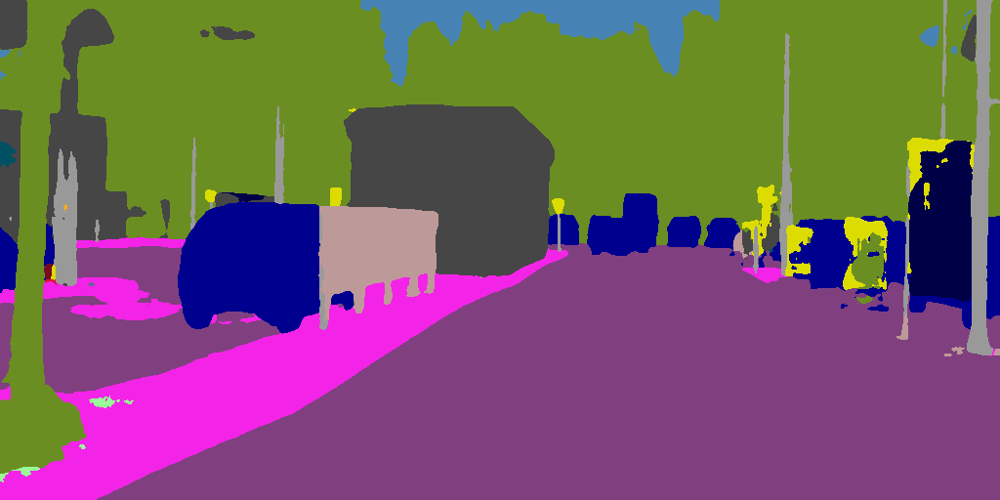

# General-Image-Anonymization

## Abstract

Official PyTorch implementation for General Image Anonymization based on Stable Diffusion.

## Usage

### Create a Virtual Environment

```bash
python -m venv venv
. venv/bin/activate
cd src
```

### Install packages

```bash
pip install torch==1.11.0+cu113 torchaudio==0.11.0+cu113 torchvision==0.12.0+cu113 -f https://download.pytorch.org/whl/torch_stable.html
pip install pytorch_lightning==1.4.2
pip install torchmetrics==0.6.0
pip install omegaconf
pip install opencv-python
pip install einops
pip install invisible-watermark
pip install tqdm
pip install kornia
pip install transformers
pip install open-clip-torch
pip install -U openmim
mim install mmcv
pip install mmcv-full
pip install mmsegmentation==0.30.0
pip install mmengine==0.8.3
pip install mmdet==2.28.1
cd ops_dcnv3
sh make.sh
```

### Anonymization

Run the following command in terminal:

```bash
python main.py <folder>
```

### Pipeline

The default pipeline is:

1. **Input** image $\mathcal{A}$ ;
2. **Segment** $\mathcal{A}$ and output segmentation result $\mathcal{S}$ ;
3. For each label $l$ in $L$ (default: ["car", "truck", "human", "traffic sign", "building", "road"]) :
   1. Get pixel-level mask $\mathcal{S}_l$ from $\mathcal{S}$ ;
   2. Generate random noise $\mathcal{N}_l$ with the shape of mask $\mathcal{S}_l$, cover $\mathcal{A}$ with the random noise $\mathcal{N}_l$, and output as $\tilde{\mathcal{A}_l}$ ;
   3. **Anonymize** $\tilde{\mathcal{A}_l}$ with label $l$, and output as $\mathcal{B}_l$ ;
4. **Merge** all $\mathcal{B}_l$ by corresponding mask $\mathcal{S}_l$ with input image $\mathcal{A}$, and output as $\hat{\mathcal{B}}$ ;
5. **Repaint** (img2img) $\hat{\mathcal{B}}$ and output as $\mathcal{B}$ ;
6. Output $\mathcal{B}$ .

We provides four different ways for the "Anonymize" step, you can edit `main.py`, import them from corresponding files instead of `inpaint_test` to use them:

- **Stable Diffusion Inpainting** (default)
- Blur
- Pixelize
- Black Mask

### Customize Your Own Plugin

Implement the given template `custom_test.py` to create a plugin for "Anonymize" step.

## TODO

- Replace os.path to pathlib to improve compatibility
- 

## Hyperparameters and Prompts

### Inpainting

#### Human

**Positive Prompt**: masterpiece, realistic, cityscapes, street, human, real

**Negative Prompt**: watermark, username, error, anime, nsfw, low quality, lowres, no\_humans

#### Car

**Positive Prompt**: masterpiece, realistic, cityscapes, street, car, no\_humans

**Negative Prompt**: watermark, username, error, anime, nsfw, low quality, lowres, human

#### Traffic Sign

**Positive Prompt**: masterpiece, realistic, cityscapes, street, traffic sign, no\_humans

**Negative Prompt**: watermark, username, error, anime, nsfw, low quality, lowres, human

#### Road

**Positive Prompt**: masterpiece, realistic, cityscapes, street, road, no\_humans

**Negative Prompt**: watermark, username, error, anime, nsfw, low quality, lowres, human, animal, painting, poster

#### Building

**Positive Prompt**: masterpiece, realistic, cityscapes, street, building, no\_humans

**Negative Prompt**: watermark, username, error, anime, nsfw, low quality, lowres, human, animal, painting

#### Hyperparameters of Inpainting:

**Denoising Steps**: 50 (i.e. Strength = 1.0)

**Scale**: 9.0

**Size of input and output images**: 1024×512

### Hamonizer

#### Text Prompt

**Positive Prompt**: masterpiece, best quality, realistic, photo, street, cityscapes, traffic

**Negative Prompt**: watermark, username, error, anime, nsfw, low quality, lowres, bad face

#### Hyperparameters

**Denoising Steps**: 10 (i.e. Strength = 0.2)

**Scale**: 9.0

**Size of input and output images**: 1024×512


## Gallery





